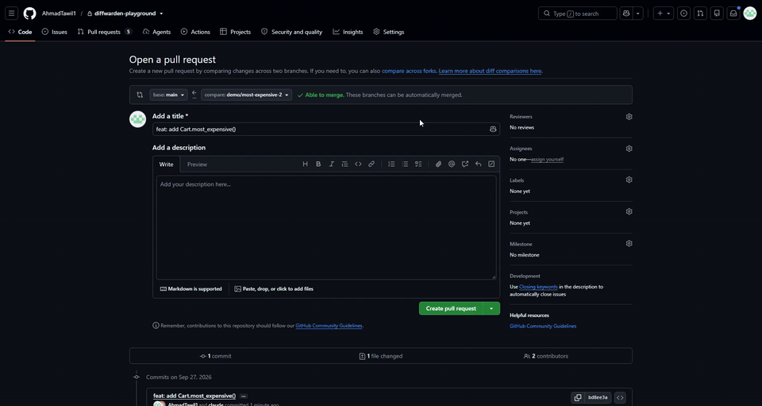
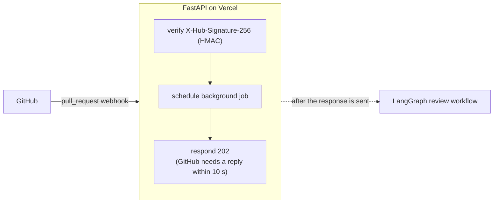

# DiffWarden

[](https://github.com/AhmadTawil1/diffwarden/actions/workflows/tests.yml) [](LICENSE)

DiffWarden is an AI pull request reviewer that runs as a GitHub App. When a pull request is opened or updated, it reads the diff, asks Claude to find real bugs, security holes, and performance problems, has a second Claude pass double-check each finding, and posts one GitHub review with inline comments on the exact lines, including one-click **Commit suggestion** fixes. It stays quiet on correct code, never repeats a comment on later pushes, and skips draft PRs.



Built with FastAPI, LangGraph, and the Anthropic API; deployed on Vercel.

## Architecture



**Review workflow** (based on the compiled graph, `review_graph.get_graph(xray=True).draw_mermaid()`, with labels edited for readability):


The engine subgraph has no GitHub dependency, so the eval script runs exactly the same graph on local test cases.

## How it works

**Batching.** Changed files are filtered (deleted, binary, lockfiles, `dist/`, `*.min.js` are skipped), and every added or context line is labeled with its real line number (`L42`). The model copies these labels instead of counting lines, which is what keeps comments on the right line. Files are packed into batches of about 60k characters, and LangGraph's `Send` reviews all batches in parallel; if a reply is cut off at the token limit, that batch is split in half and retried.

**Verifier.** A second, stricter Claude pass sees each candidate finding with about 15 lines of surrounding code and keeps it only if the issue is real and actually present: speculative, style-only, or already-handled findings are dropped. Both passes use structured outputs (a JSON schema) and Pydantic validation, so malformed answers never reach GitHub.

**Line validation.** GitHub rejects a whole review if one comment is on a line outside the diff, so every finding is checked against the patch's commentable lines, filtered by confidence, sorted by severity, and capped. A suggestion is only attached when it has exactly as many lines as the range it replaces, so **Commit suggestion** can never duplicate or delete code.

**Dedupe.** Each comment carries a hidden marker with a fingerprint: a hash of the file, the category, and the code on the commented line (not the model's wording, and not the line number). Before posting, DiffWarden reads the markers already on the PR, so an issue it has reported is never posted again, even when the model rewords it or the code moves.

## Results

28 eval cases in Python and JavaScript: 15 seeded bugs (off-by-one, missing `await`, `None` access, SQL injection, wrong comparison, swallowed exception, unclosed connection, mutable default, wrong loop variable, integer division, missing validation, race condition, N+1 query, hard-coded secret, wrong boolean logic), 3 bugs buried in 216–294 line files, 2 diffs with two bugs each, 5 clean refactors, and 3 **decoys** (correct code that looks wrong). Model `claude-sonnet-5`; mean of 3 runs, range in brackets.

| Verifier | Threshold | Recall | Precision | FP / clean | FP / decoy | Avg latency | Avg cost / review |
|---|---|---|---|---|---|---|---|
| off | 0.5 | 100% | 100% | 0.00 | 0.00 | 7.2s | $0.0103 |
| off | 0.7 | 95% (91–100%) | 100% | 0.00 | 0.00 | 7.2s | $0.0103 |
| off | 0.8 | 77% (73–82%) | 100% | 0.00 | 0.00 | 7.2s | $0.0103 |
| on | 0.5 | 100% | 100% | 0.00 | 0.00 | 9.2s | $0.0127 |
| on | 0.7 | 95% (91–100%) | 100% | 0.00 | 0.00 | 9.2s | $0.0127 |
| on | 0.8 | 77% (73–82%) | 100% | 0.00 | 0.00 | 9.2s | $0.0127 |

Each run reviews every case once and verifies those same findings, so the verifier and threshold rows differ only by what they filter. Three results stand out:

- **The verifier had no effect here.** It kept all 74 findings across 3 runs, adding about 2 seconds and 24% cost per review. The reviewer produced no false positives, even on the decoys, so there was nothing to remove. It stays in the pipeline (switchable with `VERIFY_FINDINGS`) as a guard for noisier real-world diffs, where it hasn't been measured yet.
- **Every bug was found; confidence is what loses them.** At 0.5 recall is 100% with no precision cost; the misses at 0.7 are real bugs the model rated 0.6. The default stays at 0.7 until that is confirmed on real PRs.
- **Reading the errors fixed my ground truth.** One "false positive" on a decoy was a real bug in the decoy (it accepted a price of `"Infinity"`), and one case's line ranges were too narrow. Both were corrected and re-scored.

The set is small and synthetic, so treat these numbers as an upper bound; full method and error analysis are in [`eval/RESULTS.md`](eval/RESULTS.md).

End-to-end on GitHub, the deployed app was checked on real PRs: a planted bug gets a comment on the exact line, **Commit suggestion** applies a correct fix, unrelated pushes don't repeat comments, only new bugs are posted on later pushes, and clean PRs get no review. On Vercel, GitHub gets the `202` in about 0.2 s (4.5 s on a cold start, still inside its 10-second limit), and the review is posted about 7 seconds later.

## Setup

### 1. Create a GitHub App

GitHub → **Settings → Developer settings → GitHub Apps → New GitHub App**:

- **Webhook URL**: your deployed URL + `/api/webhook` (or a smee.io channel for local development).
- **Webhook secret**: a random string, e.g. `uv run python -c "import secrets; print(secrets.token_hex(32))"`.
- **Repository permissions**: Pull requests **Read and write**, Contents **Read-only** (Metadata becomes read-only automatically).
- **Subscribe to events**: **Pull request**.
- **Where can this app be installed**: Only on this account.

After creating it, note the **App ID**, click **Generate a private key** (downloads a `.pem`; keep it outside the repo), and **Install App** on the repositories you want reviewed.

### 2. Environment variables

Copy `.env.example` to `.env` and fill it in:

| Variable | Value |
|---|---|
| `ANTHROPIC_API_KEY` | Your Anthropic API key |
| `ANTHROPIC_MODEL` | `claude-sonnet-5` |
| `GITHUB_APP_ID` | The App ID |
| `GITHUB_PRIVATE_KEY_BASE64` | The `.pem` file, base64-encoded on one line: `base64 -w0 key.pem` (macOS: `base64 -i key.pem`) |
| `GITHUB_WEBHOOK_SECRET` | The webhook secret |
| `MIN_CONFIDENCE` | `0.7` (findings below this are not posted) |
| `MAX_COMMENTS` | `15` (per review) |
| `VERIFY_FINDINGS` | `true` (run the verifier pass) |
| `INPUT_PRICE_PER_MTOK` | `2.0` (USD per million input tokens, used for cost tracking in the eval) |
| `OUTPUT_PRICE_PER_MTOK` | `10.0` (USD per million output tokens) |

`.env` is git-ignored; never commit it.

### 3. Run locally

Requires Python 3.13 and [uv](https://docs.astral.sh/uv/). Node.js is only needed for the smee client.

```bash
uv sync
uv run uvicorn app.main:app --reload --port 8000

# second terminal: forward GitHub webhooks to your machine
npx smee-client -u https://smee.io/<your-channel> -t http://localhost:8000/api/webhook
```

Set the smee URL as the App's webhook URL, then open a PR on a repository where the App is installed. `http://localhost:8000/healthz` should return `{"status": "ok"}`.

### 4. Deploy (Vercel)

Import the repository at [vercel.com/new](https://vercel.com/new) (Vercel detects FastAPI from `app/main.py`), add the same environment variables, and deploy. Then set the App's webhook URL to `https://<project>.vercel.app/api/webhook`, using the project's production domain: per-deployment URLs are behind Vercel's login and GitHub can't reach them.

### Tests and evals

```bash
uv run pytest -q                                         # unit tests, no network or API calls (also run in CI)
uv run python -m eval.run --runs 3                       # 3 eval runs, about $0.35 each
uv run python -m eval.run --from <stamp>                 # re-score saved runs, no API calls
uv run python -m eval.run --from <stamp> --rerun <case>  # re-run one case inside saved runs
```

Each run reviews every case once and then verifies those same findings, so every verifier/threshold configuration is scored from the same reviewer output. Options: `--thresholds 0.5 0.7 0.8` (the default) and `--max-cost` (default `1.00`), which stops starting new cases once that many dollars have been spent. Runs are saved to `eval/results/<stamp>-run<i>.json` and the summary to `<stamp>-summary.json` (git-ignored).

## Project layout

```
app/
  main.py           FastAPI: /healthz, /api/webhook, signature check, background job
  config.py         settings from environment variables
  github.py         GitHub App JWT, installation token client, pagination
  lines.py          which diff lines GitHub accepts comments on
  render.py         filtering, line labels, batching, comment format, fingerprints
  schema.py         finding/verdict models and JSON schemas
  prompts.py        review and verifier prompts
  llm.py            structured Claude calls
  graph/
    state.py        LangGraph state
    engine.py       plan_batches → parallel review_batch → verify
    review.py       fetch_files → engine → validate → post_review
eval/
  cases/            28 cases: case.patch + truth.json
  run.py            eval runner and metrics
  RESULTS.md        results and error analysis
tests/              pytest suite
scripts/            manual checks (auth, one review, prompts, engine, verifier)
docs/               demo GIF and build notes
.github/workflows/  CI: runs the tests on every push and pull request
```

## Security

- **Webhook authenticity:** every request is checked against `X-Hub-Signature-256` (HMAC-SHA256 over the raw body, compared in constant time); unsigned or invalid requests get `401` before anything is parsed.
- **Prompt injection:** only the diff (file paths and changed lines) is sent to Claude, never the PR title or description, and both prompts treat it as untrusted data and tell the model never to follow instructions found inside it. The model's answer is forced into a JSON schema and validated, and only comments on lines inside the diff, above the confidence threshold, and within the comment cap are posted. A crafted diff can still influence the wording of a comment, but not where or how many comments are posted.
- **Mentions:** `@name` in comment titles and explanations is neutralized with a zero-width space, so DiffWarden can't ping users. Suggested code is left unchanged (GitHub doesn't turn `@` in code blocks into mentions, and editing it would break the code).
- **Least privilege:** the App asks only for Pull requests (read and write) and Contents (read-only), and is installed only on the repositories it should review. It never pushes code; suggestions are applied only when a person clicks **Commit suggestion**.
- **Secrets:** the private key, webhook secret, and API key live only in environment variables; `.env` and `*.pem` are git-ignored. Settings errors at startup name the missing variable without printing any values, and the API key is held as a `SecretStr`.

## Limitations

- **Sees only the diff** and a few context lines, not the whole codebase, so bugs that depend on code elsewhere can be missed.
- **Reviews run inside the webhook's function invocation** (up to 300 s on Vercel Hobby). If one fails, that commit isn't retried automatically; the next push, or a redelivery from the App's Recent Deliveries page, triggers a new review.
- **No database.** Commits already processed are remembered only in memory, per instance; posted comments are deduplicated through the fingerprints stored on GitHub.
- **The verifier costs one more LLM call per review** (about 2 s and 24% more cost). It is meant to cut false positives, but on the eval set it removed nothing because the reviewer made none; its value on noisier real-world diffs is unmeasured. Set `VERIFY_FINDINGS=false` to skip it.
- **Suggestions that add or remove lines are posted without the Commit suggestion button**, a safety trade-off.
- **Supports human review; it never blocks merges.**
