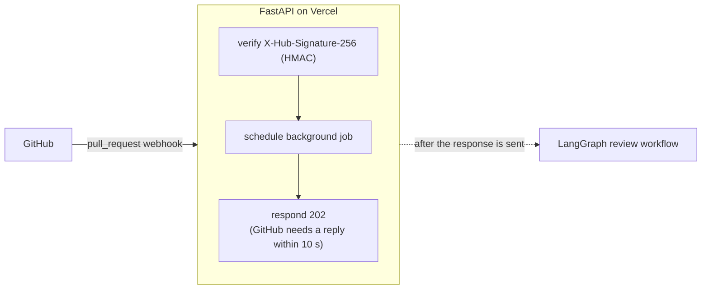
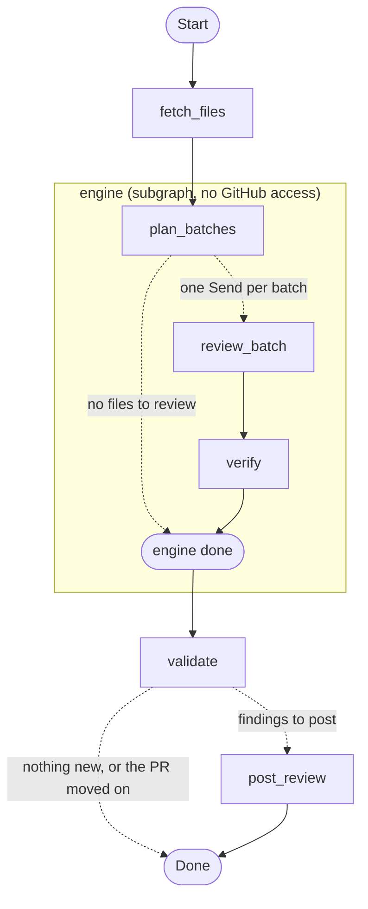

# DiffWarden

DiffWarden is an AI pull request reviewer that runs as a GitHub App. When a pull request is opened or updated, it reads the diff, asks Claude to find real bugs, security holes, and performance problems, has a second Claude pass double-check each finding, and posts one GitHub review with inline comments on the exact lines, including one-click **Commit suggestion** fixes. It stays quiet on correct code, never repeats a comment on later pushes, and skips draft PRs.


Built with FastAPI, LangGraph, and the Anthropic API; deployed on Vercel.

## Architecture



**Review workflow** (generated from the compiled graph with `review_graph.get_graph(xray=True).draw_mermaid()`):



The engine subgraph has no GitHub dependency, so the eval script runs exactly the same graph on local test cases.

## How it works

**Batching.** Changed files are filtered (deleted, binary, lockfiles, `dist/`, `*.min.js` are skipped), and every added or context line is labeled with its real line number (`L42`). The model copies these labels instead of counting lines, which is what keeps comments on the right line. Files are packed into batches of about 60k characters, and LangGraph's `Send` reviews all batches in parallel; if a reply is cut off at the token limit, that batch is split in half and retried.

**Verifier.** A second, stricter Claude pass sees each candidate finding with about 15 lines of surrounding code and keeps it only if the issue is real and actually present: speculative, style-only, or already-handled findings are dropped. Both passes use structured outputs (a JSON schema) and Pydantic validation, so malformed answers never reach GitHub.

**Line validation.** GitHub rejects a whole review if one comment is on a line outside the diff, so every finding is checked against the patch's commentable lines, filtered by confidence, sorted by severity, and capped. A suggestion is only attached when it has exactly as many lines as the range it replaces, so **Commit suggestion** can never duplicate or delete code.

**Dedupe.** Each comment carries a hidden marker with a fingerprint: a hash of the file, the category, and the code on the commented line (not the model's wording, and not the line number). Before posting, DiffWarden reads the markers already on the PR, so an issue it has reported is never posted again, even when the model rewords it or the code moves.

## Results

20 eval cases: 15 seeded bugs in Python and JavaScript (off-by-one, missing `await`, `None` access, SQL injection, wrong comparison, swallowed exception, unclosed connection, mutable default, wrong loop variable, integer division, missing validation, race condition, N+1 query, hard-coded secret, wrong boolean logic) and 5 clean refactors. Model `claude-sonnet-5`, one run per configuration.

| Verifier | Threshold | Recall | Precision | FP / clean case | Avg latency |
|---|---|---|---|---|---|
| off | 0.7 | 93% | 100% | 0.00 | 4.6s |
| on | 0.7 | 100% | 100% | 0.00 | 6.8s |
| on | 0.5 | 100% | 94% | 0.00 | 6.1s |
| on | 0.8 | 80% | 100% | 0.00 | 6.1s |

It never commented on correct code, and 0.7 is the sweet spot: 0.5 lets in low-confidence extras (the only unmatched finding was a real edge case the test didn't plan for), while 0.8 starts dropping real bugs that the model rated 0.75–0.8. On this set the verifier added about 2 seconds per case without a measurable quality difference, because the reviewer was already precise. The set is small and easy (short files, one obvious bug each) and each configuration ran once, so treat these as upper bounds; details and error analysis are in [`eval/RESULTS.md`](eval/RESULTS.md).

End-to-end on GitHub, the deployed app was checked on real PRs: a planted bug gets a comment on the exact line, **Commit suggestion** applies a correct fix, unrelated pushes don't repeat comments, only new bugs are posted on later pushes, and clean PRs get no review.

## Setup

### 1. Create a GitHub App

GitHub → **Settings → Developer settings → GitHub Apps → New GitHub App**:

- **Webhook URL**: your deployed URL + `/api/webhook` (or a smee.io channel for local development).
- **Webhook secret**: a random string, e.g. `uv run python -c "import secrets; print(secrets.token_hex(32))"`.
- **Repository permissions**: Pull requests **Read and write**, Contents **Read-only** (Metadata becomes read-only automatically).
- **Subscribe to events**: **Pull request**.
- **Where can this app be installed**: Only on this account.

After creating it, note the **App ID**, click **Generate a private key** (downloads a `.pem`; keep it outside the repo), and **Install App** on the repositories you want reviewed.

### 2. Environment variables

Copy `.env.example` to `.env` and fill it in:

| Variable | Value |
|---|---|
| `ANTHROPIC_API_KEY` | Your Anthropic API key |
| `ANTHROPIC_MODEL` | `claude-sonnet-5` |
| `GITHUB_APP_ID` | The App ID |
| `GITHUB_PRIVATE_KEY_BASE64` | The `.pem` file, base64-encoded on one line: `base64 -w0 key.pem` (macOS: `base64 -i key.pem`) |
| `GITHUB_WEBHOOK_SECRET` | The webhook secret |
| `MIN_CONFIDENCE` | `0.7` (findings below this are not posted) |
| `MAX_COMMENTS` | `15` (per review) |
| `VERIFY_FINDINGS` | `true` (run the verifier pass) |

`.env` is git-ignored; never commit it.

### 3. Run locally

Requires Python 3.13 and [uv](https://docs.astral.sh/uv/). Node.js is only needed for the smee client.

```bash
uv sync
uv run uvicorn app.main:app --reload --port 8000

# second terminal: forward GitHub webhooks to your machine
npx smee-client -u https://smee.io/<your-channel> -t http://localhost:8000/api/webhook
```

Set the smee URL as the App's webhook URL, then open a PR on a repository where the App is installed. `http://localhost:8000/healthz` should return `{"status": "ok"}`.

### 4. Deploy (Vercel)

Import the repository at [vercel.com/new](https://vercel.com/new) (Vercel detects FastAPI from `app/main.py`), add the same environment variables, and deploy. Then set the App's webhook URL to `https://<project>.vercel.app/api/webhook`, using the project's production domain: per-deployment URLs are behind Vercel's login and GitHub can't reach them.

### Tests and evals

```bash
uv run pytest -q                                         # unit tests, no network or API calls
uv run python -m eval.run --verifier on --threshold 0.7  # full eval, about 40 Claude calls
```

Eval results are saved to `eval/results/<timestamp>.json` (git-ignored).

## Project layout

```
app/
  main.py           FastAPI: /healthz, /api/webhook, signature check, background job
  config.py         settings from environment variables
  github.py         GitHub App JWT, installation token client, pagination
  lines.py          which diff lines GitHub accepts comments on
  render.py         filtering, line labels, batching, comment format, fingerprints
  schema.py         finding/verdict models and JSON schemas
  prompts.py        review and verifier prompts
  llm.py            structured Claude calls
  graph/
    state.py        LangGraph state
    engine.py       plan_batches → parallel review_batch → verify
    review.py       fetch_files → engine → validate → post_review
eval/
  cases/            20 cases: case.patch + truth.json
  run.py            eval runner and metrics
  RESULTS.md        results and error analysis
tests/              pytest suite
scripts/            manual checks (auth, one review, prompts, engine, verifier)
```

## Limitations

- **Sees only the diff** and a few context lines, not the whole codebase, so bugs that depend on code elsewhere can be missed.
- **Reviews run inside the webhook's function invocation** (up to 300 s on Vercel Hobby). If one fails, that commit isn't retried automatically; the next push, or a redelivery from the App's Recent Deliveries page, triggers a new review.
- **No database.** Commits already processed are remembered only in memory, per instance; posted comments are deduplicated through the fingerprints stored on GitHub.
- **The verifier costs one more LLM call per review** (more latency and cost) in exchange for fewer false positives.
- **Suggestions that add or remove lines are posted without the Commit suggestion button**, a safety trade-off.
- **Supports human review; it never blocks merges.**
